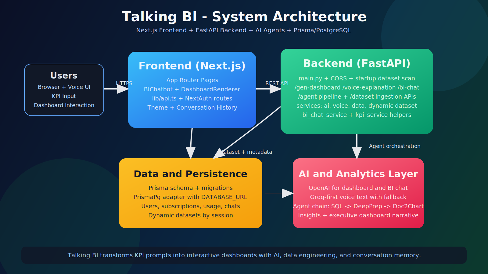

# Talking BI - Technical Documentation

<p align="center">
  
  
  
  
</p>

## 1. Product Summary

Talking BI converts KPI prompts into multi-chart business dashboards with AI-assisted narratives, BI chat, and optional voice explanation.

Primary experience:

1. User enters KPI prompt.
2. Frontend triggers backend dashboard generation.
3. Backend executes AI/data pipeline.
4. Frontend renders dashboard cards and charts.
5. User can continue with BI chat and voice explanation.

## 2. Architecture

### 2.1 Visual System Diagram



### 2.2 Runtime Components

| Component | Location | Responsibility |
|---|---|---|
| Next.js App Router | frontend/app | UI screens, auth routes, chat/dashboard pages |
| API Client Layer | frontend/lib/api.ts | Calls backend APIs and internal app routes |
| FastAPI Entry | backend/app/main.py | App lifecycle, CORS setup, router wiring |
| Dashboard Router | backend/app/routers/dashboard.py | Dashboard generation, voice, BI chat endpoints |
| Agent Router | backend/app/routers/agents.py | SQL/DeepPrep/Doc2Chart/Insights pipeline stages |
| Dataset Router | backend/app/routers/dataset.py | URL dataset ingestion/status/cleanup |
| Prisma + PostgreSQL | frontend/prisma + frontend/lib/prisma.ts | Auth, usage, conversation, dynamic dataset persistence |

## 3. Request Workflows

### 3.1 KPI to Dashboard Workflow


### 3.2 Detailed Flow (URL Dataset Mode)

1. Frontend sends POST `/gen-dashboard` with `kpi`, `user_id`, `session_id`, `use_url_dataset=true`.
2. Backend loads dataset for session/user from dynamic dataset service.
3. SQL Agent (`run_sql_agent`) filters/selects KPI-relevant rows.
4. DeepPrep Agent (`run_deepprep_agent`) cleans and normalizes rows.
5. Doc2Chart Agent (`run_doc2chart_agent`) maps prepared rows to chart slots.
6. Insights Agent (`run_insights_agent`) generates narrative context.
7. Combined payload returns to frontend and gets transformed into dashboard render model.

### 3.3 Detailed Flow (CSV Fallback Mode)

1. Frontend sends POST `/gen-dashboard` with `use_url_dataset=false` (or no active dynamic dataset).
2. Backend aggregates local CSV data via data service.
3. AI service generates dashboard spec from aggregated rows + chart/theme preferences.
4. Frontend renders returned `dashboards` with selected themes.

## 4. API Contract Overview

| Endpoint | Input | Output |
|---|---|---|
| `GET /ping` | none | `{ status: "alive" }` |
| `GET /health` | none | `{ status: "ok" }` |
| `GET /datasets` | none | local dataset catalog |
| `POST /gen-dashboard` | KPI + chart/theme + user/session flags | dashboard spec or doc2chart + insights bundle |
| `POST /voice-explanation` | dashboard spec + KPI | transcript + spoken variants + optional audio |
| `POST /bi-chat` | question + KPI + dashboard spec | BI answer + sources |
| `POST /dataset/ingest` | URL + user/session IDs | dataset id, schema, row sample |
| `GET /dataset/status/{sessionId}` | session id | active dataset state |
| `DELETE /dataset/cleanup/{sessionId}` | session id | cleanup result |

## 5. Data and Persistence Model

Prisma models capture user and product usage lifecycle:

- User, Account, Session, VerificationToken for authentication.
- Subscription and UsageEvent for pricing and metering.
- Conversation and Message for BI chat history.
- DynamicDataset for URL-ingested temporary datasets by session.

Important implementation detail for Prisma 7.5.0 in this repo:

- `datasource.url` is defined via `frontend/prisma.config.ts`.
- Prisma client is instantiated using PrismaPg adapter in `frontend/lib/prisma.ts`.

## 6. Configuration

### 6.1 Backend Environment Variables

| Variable | Required | Notes |
|---|---|---|
| `OPENAI_API_KEY` | Yes | Used for dashboard/chat generation |
| `GROQ_API_KEY` | Recommended | Used first for voice explanation text path |
| `ALLOWED_ORIGINS` | Recommended | Comma-separated explicit CORS origins |
| `ALLOWED_ORIGIN_REGEX` | Optional | Regex CORS allowlist (Vercel pattern etc.) |

### 6.2 Frontend Environment Variables

| Variable | Required | Notes |
|---|---|---|
| `NEXT_PUBLIC_API_URL` | Yes | FastAPI base URL |
| `DATABASE_URL` | Yes (for auth/storage) | PostgreSQL connection string |
| `NEXTAUTH_SECRET` | Yes | NextAuth session signing |
| `NEXTAUTH_URL` | Yes | Public frontend URL |
| `GOOGLE_CLIENT_ID` | Optional | Google OAuth provider |
| `GOOGLE_CLIENT_SECRET` | Optional | Google OAuth provider |

## 7. Local Development

### 7.1 Backend

```bash
cd backend
python -m venv venv
# Linux/macOS
source venv/bin/activate
# Windows
venv\Scripts\activate
pip install -r requirements.txt
uvicorn app.main:app --reload --port 8000
```

### 7.2 Frontend

```bash
cd frontend
npm install
npx prisma generate
npm run dev
```

## 8. Deployment Guidance

- Backend: Render is preconfigured through `render.yaml`.
- Frontend: Deploy on Vercel and point `NEXT_PUBLIC_API_URL` to deployed backend.
- Ensure backend CORS includes production frontend origin.
- Update NextAuth callback URL for production.

## 9. Extension Ideas

1. Add role-based dashboard templates by industry.
2. Introduce async job queue for long-running dataset processing.
3. Add observability stack for latency/token tracking by endpoint.
4. Add persisted dashboard snapshots per conversation.

## 10. File Index

- Root overview: [README.md](README.md)
- Prisma/Auth details: [frontend/PRISMA_AUTH_SETUP.md](frontend/PRISMA_AUTH_SETUP.md)
- Architecture visual: [docs/images/system-architecture.svg](docs/images/system-architecture.svg)
- Workflow visual: [docs/images/workflow.svg](docs/images/workflow.svg)
